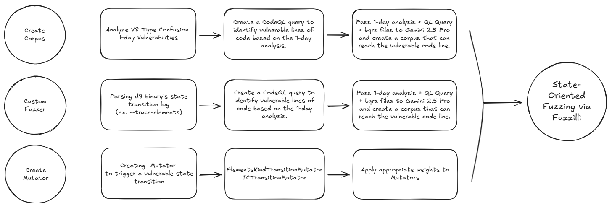
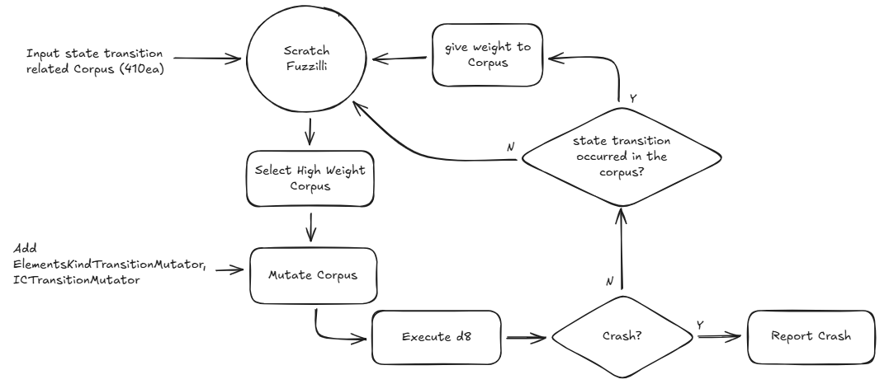
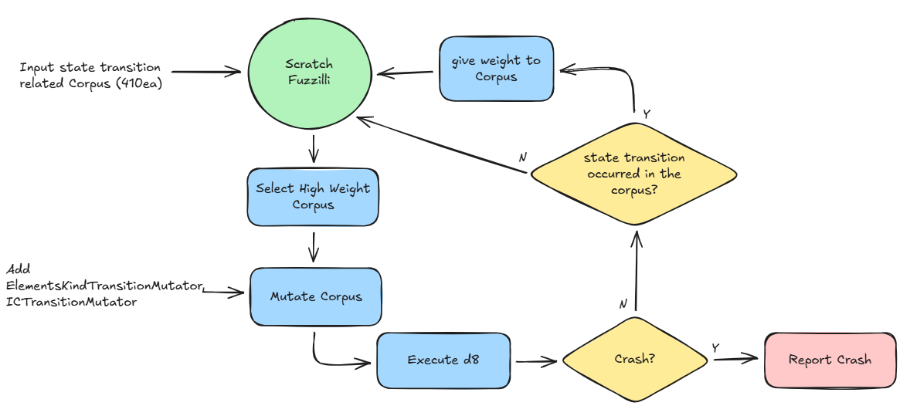

<p align="center">
  
  
  
  
  
</p>

<hr>

## What is Scratch Fuzzilli?
**Scratch Fuzzilli** is an enhanced, state-aware JavaScript fuzzer built upon the original **Fuzzilli**(https://github.com/googleprojectzero/fuzzilli). Like its predecessor, it is based on Swift but incorporates the following key improvements.
- State Transition Corpus Generation: Generates corpora focused on state transitions using CodeQL and Gemini.
- Weighted Corpus Scoring: Applies scoring bonuses to the corpus based on specific state transitions.
- State Transition Mutator: Introduces a dedicated mutator designed to handle state transitions.

## Install
Scratch Fuzzilli basically supports Linux(x64).<br>
The basic steps to use this fuzzer are:

```bash
# clone repository
git clone https://github.com/scratch-bug/scratch_fuzzilli.git

# patch v8 with running Tools/patch_v8.py
python3 Tools/patch_v8.py /path/to/v8

# build v8 with fuzzbuild args
ninja -C /path/to/fuzzbuild d8

# Compile the fuzzer
swift build [-c release]

# Run the fuzzer
swift run [-c release] FuzzilliCli --profile=<profile> [other cli options] /path/to/d8

```

### Mutator Upgrade

In addition to the existing mutators, we have implemented ElementsKindMutator and ICTransitionMutator to specifically focus on state transitions. These are not included in the main branch, so you must switch to the mutator branch to use them.
```bash
# connect to git branches
git fetch origin

# change branch to mutator
git checkout -b mutator origin/mutator
```

## Concept

While standard Fuzzilli is a coverage-guided fuzzer, our Scratch Fuzzilli is a state-aware fuzzer.
An analysis of crashes found by Fuzzilli reveals a high frequency of Type Confusion vulnerabilities. These often occur during state transitions within V8, such as transitions from Packed to Holey or Smi to Double.
The concept of state-aware fuzzing is well-documented in other domains. For instance, research on state-aware fuzzing targeting Linux drivers is available here. Motivated by this, we have enhanced Fuzzilli to focus on state transitions.

<br>

Key Improvements:
1. AI-Generated Corpus (CodeQL): Although not detailed in this repository, we analyzed numerous 1-day state transition vulnerabilities and patterned them using CodeQL. We then utilized AI to generate a corpus specifically designed to traverse these vulnerable V8 code paths. (You can check ql queries at `/codeql/`)
3. Weighted Corpus based on Transitions: We assigned weights to the corpus based on state transition types. By enabling specific d8 options (e.g., --trace-elements), V8 outputs logs corresponding to these transitions. Fuzzilli is configured to track and parse these logs directly to apply appropriate weights.
4. State-Transition Mutators: We developed custom Mutators dedicated to state transitions. Currently, ElementsKindTransitionMutator and ICTransitionMutator are implemented, with plans to add more in the future.
Note: Weights for specific state transitions and Mutators can be reconfigured by directly modifying the source code.





Through these improvements, the fuzzer is designed to induce a higher frequency of vulnerable state transitions within the JavaScript engine.

### Fuzzer Workflow
We customized Fuzzilli with the following workflow.


The Scratch Fuzzilli fuzzer works with the following workflow.


## Result
We fuzzed the V8 JavaScript engine from 2025.10.1 to 2025.12.20, discovering 28 crashes and fixing 5 bugs.

## Disclaimer
This is not an officially supported Google product.<br>
Customized by BoB 14th Scratch BugBug! Team.
